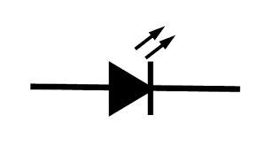
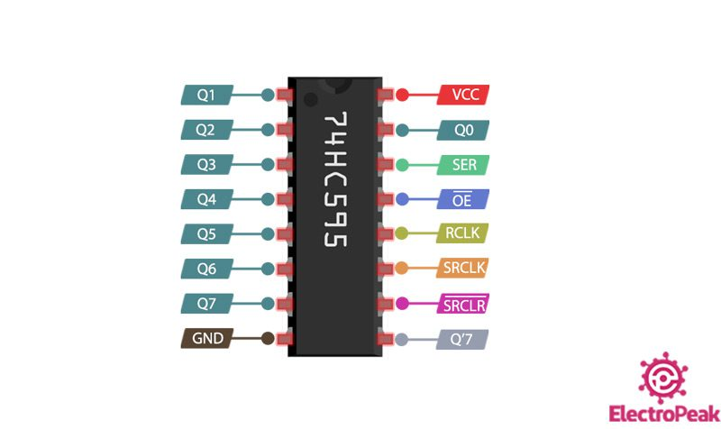

# Elektrische componenten

## Input

| Component               | Visual                         | Korte beschrijving |
| ------------------------| ------------------------------ | --------------     |
| [LED](#LED)             |       | Lamp               |

### LED

- KORT = anode = negatief
- LANG = cathode = positief

Steeds een weerstand nodig want elke LED heeft een vast spanning ($\pm2V$) en stroomsterkte ($\pm20mA$) .

Meer info op [Resistors for LED Circuits](https://eepower.com/resistor-guide/resistor-applications/resistor-for-led/#)

## Output

## Varia
| Component                         | Visual                                     | Korte beschrijving |
| ----------------------------------| ------------------------------             | --------------     |
| [Shift register](#shift-register) |       | Uitbreiden GPIO pinnen               |

### Shift register
Twee varianten:

 - SIPO (serial-in-parallel-out): vb. 8/16 LED's aansturen met 1 GPIO pin
 - PISO (parallel-in-serial-out): vb. verschillende controller inputs naar één kanaal 

Meest gebruikte is 74HC595 - "8-bit serial-in, serial or parallel-out shift register with output latches; 3-state." Die gebruikt slechts 3 GPIO pinnen: 

- dataPin: serie bits die geparalleliseerd moeten worden
- clockPin: lees volgende bit in data serie
- latchPin: zet output pinnen actief volgens serie

Bovendien heeft deze een output pin zodat meerdere shiftregisters in parallel gezet kunnen worden.

Voor meer info zie [LED Dot Matrix](https://super-starter-kit-for-raspberry-pi.readthedocs.io/en/latest/1.1.3%20LED%20Dot%20Matrix.html) of [Serial to Parallel Shifting-Out with a 74HC595](https://docs.arduino.cc/tutorials/communication/guide-to-shift-out/)