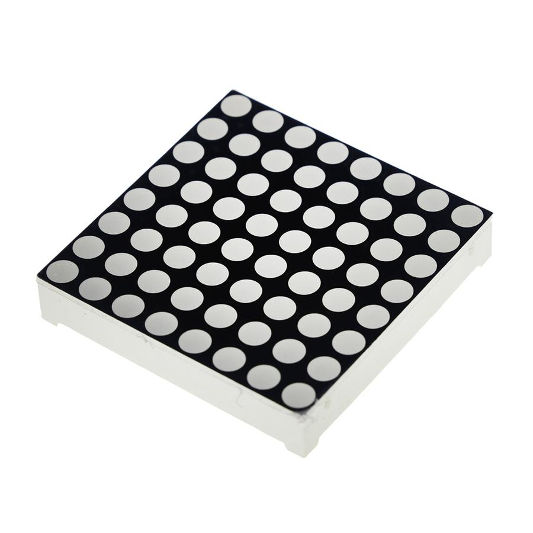
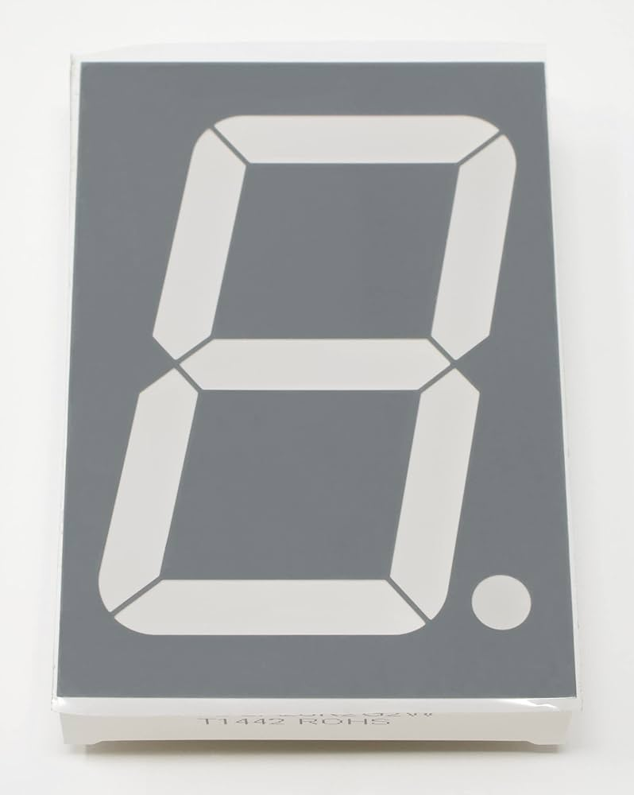
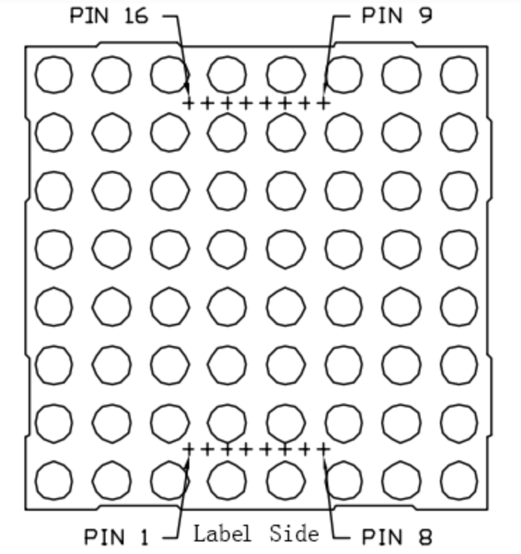
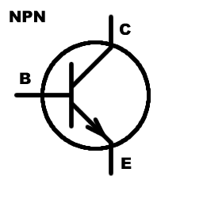
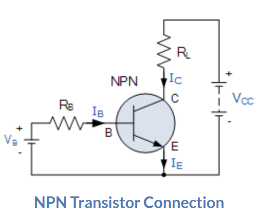

# Elektrische componenten

## Output

| Component                | Visual                         | Korte beschrijving |
| ------------------------ | ------------------------------ | --------------     |
| [LED](#LED)              |       | Lamp               |
| [LED matrix](#LED-matrix)|   | Lamp matrix        | 
| [7 segment](#7-segment) |   | Digit        | 

### LED

- KORT = anode = negatief
- LANG = cathode = positief

Steeds een weerstand nodig want elke LED heeft een vast spanning ($\pm2V$) en stroomsterkte ($\pm20mA$) .

Meer info op [Resistors for LED Circuits](https://eepower.com/resistor-guide/resistor-applications/resistor-for-led/#)

### LED-matrix
**Aansturen door middel van shift register omwille van vele input pinnen!**

De pins van een LED-matrix hebben de volgende ordenning:

Deze pinnen komen overeen met volgende fysieke LED's:
|     |    |    |   |    |   |    |    |    |
|-----|----|----|---|----|---|----|----|----|
| COL | 1  | 2  | 3 | 4  | 5 | 6  | 7  | 8  |
| pin | 13 | 3  | 4 | 10 | 6 | 11 | 15 | 16 |
| ROW | 1  | 2  | 3 | 4  | 5 | 6  | 7  | 8  |
| pin | 9  | 14 | 8 | 12 | 1 | 7  | 2  | 5  |

LED's kan je laten branden door (afhankelijk van type LED-matrix):

- CA LED: ROW HIGH - COL LOW 
- CC LED: ROW LOW - COL HIGH 

Voor meer info zie [LED Dot Matrix](https://super-starter-kit-for-raspberry-pi.readthedocs.io/en/latest/1.1.3%20LED%20Dot%20Matrix.html).

### 7 segment
**Aansturen door middel van shift register omwille van vele input pinnen!**

De pins van een 7 segment hebben de volgende ordenning:

Voor meer info zie [7-segment Display](https://super-starter-kit-for-raspberry-pi.readthedocs.io/en/latest/1.1.4%207-segment%20Display.html).

### Buzzer

Twee types bestaan:

- Active buzzer: Maakt gelijk als DC spanning op buzzer
- Passive buzzer: Maakt geluid als AC spanning (of DC PWM)

Heeft ook een cathode en anode, **denk aan juiste richting**.

## Input

## Varia
| Component                         | Visual                                     | Korte beschrijving |
| ----------------------------------| ------------------------------             | --------------     |
| [Shift register](#shift-register) |        | Uitbreiden GPIO pinnen               |
| [NPN Transistor](#npn-transistor) |        | Elektronische schakelaar / stroomversterker               |

### Shift register
Twee varianten:

 - SIPO (serial-in-parallel-out): vb. 8/16 LED's aansturen met 1 GPIO pin
 - PISO (parallel-in-serial-out): vb. verschillende controller inputs naar één kanaal 

Meest gebruikte is 74HC595 - "8-bit serial-in, serial or parallel-out shift register with output latches; 3-state." Die gebruikt slechts 3 GPIO pinnen: 

- dataPin: serie bits die geparalleliseerd moeten worden
- clockPin: lees volgende bit in data serie
- latchPin: zet output pinnen actief volgens serie

Bovendien heeft deze een output pin zodat meerdere shiftregisters in parallel gezet kunnen worden.

Voor meer info zie [Serial to Parallel Shifting-Out with a 74HC595](https://docs.arduino.cc/tutorials/communication/guide-to-shift-out/)

### NPN Transistor

$I_C = \beta I_B, V_{BE} \approx 0,7V$

$\beta$ typisch $\pm 200$ maar te vinden op technische documentatie.

Stroom $I_B$ moet klein zijn dus typisch grote weerstand $R_B$

  

Voor meer info zie [NPN Transistor](https://www.electronics-tutorials.ws/transistor/tran_2.html)